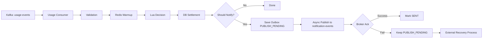
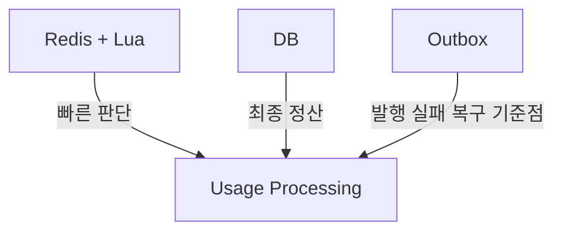
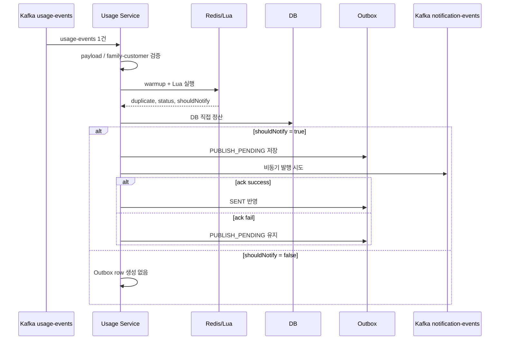



# 🚀 dabom-processor-usage

### Kafka `usage-events` 기반
### **실시간 사용량 판단 · DB 직접 정산 · Notification 발행/복구 연계 서비스**

 

  
  
  
  
  

  
  
  

---

## ✨ Overview

`dabom-processor-usage`는 DABOM 시스템에서 **사용량 이벤트 처리 전담 레포**다.

이 레포는 단순 Kafka consumer가 아니라, 아래 흐름을 **하나의 서비스 안에서 직접 처리**한다.

- `usage-events` 수신
- payload 및 `familyId-customerId` 검증
- Redis warmup
- Redis + Lua 기반 실시간 사용량 판단
- DB 직접 정산
- notification 대상 판단
- notification 즉시 비동기 발행
- 실패 건에 대한 Outbox 기반 복구 연계

### 📌 At a Glance

| Area | Responsibility |
|---|---|
| ⚡ Real-time Decision | Redis + Lua |
| 🧾 Direct Settlement | MySQL |
| 🔔 Publish & Recovery | `notification-events` + Outbox |

즉 이 레포는 아래 역할을 동시에 담당한다.

| 역할 | 설명 |
|---|---|
| ⚡ 실시간 판단 서비스 | Redis + Lua로 사용량 상태를 빠르게 계산 |
| 🧾 정산 서비스 | DB를 기준으로 최종 사용량과 quota를 반영 |
| 🔔 알림 파생 서비스 | notification 대상 여부를 결정하고 발행과 복구를 연계 |

---

## 🏗️ Architecture Summary

현재 구조는 **`usage-events` 중심 직접 처리 구조**다.

과거에는 usage 처리 결과가 `usage-persist`, `usage-realtime`, `notification-events` 등 여러 Kafka 토픽으로 분산되던 구조가 있었지만, 현재는 다음 방향으로 단순화되었다.

- DB 정산은 이 서비스가 직접 수행
- notification은 대상 이벤트만 Outbox에 저장
- usage 서비스가 먼저 즉시 비동기 발행 시도
- 실패 건은 `PUBLISH_PENDING` 유지

> 핵심은 **다중 토픽 분산 구조를 줄이고**, usage 처리의 핵심 책임을 이 서비스 안으로 모았다는 점이다.

---

## 🎯 Why This Repository Exists

사용량 처리에서는 아래 요구가 동시에 존재한다.

- **빠르게 판단해야 한다**
- **정확하게 정산해야 한다**
- **중복 이벤트와 재처리를 견뎌야 한다**
- **알림은 즉시 보내되 실패 시 복구 가능해야 한다**

이 레포는 이 요구를 아래처럼 분리해서 해결한다.

### Redis + Lua
- 빠른 판단
- dedup 제어
- 실시간 정책 처리
- 경고/차단 상태 계산

### DB
- 최종 정산
- 영속 데이터 관리
- source of truth 역할

### Outbox
- notification 대상 이벤트만 저장
- 즉시 발행 실패 시 복구 기준점 유지

---

## 🧩 Responsibilities

### 1) Validation
- payload 기본 검증
- `familyId-customerId` 관계 검증
- invalid input는 뒤 단계로 보내지 않음

### 2) Redis + Lua Decision
- Redis warmup
- duplicate 판단
- 사용량 반영
- 경고/차단 상태 계산
- 알림 dedup 판단

### 3) Direct DB Settlement
- `usage_record` 기반 멱등 정산
- `customer_quota`, `family_quota` 직접 반영
- blocked 이벤트는 차단 상태만 반영

### 4) Notification Publish & Recovery
- notification 대상 판단
- Outbox에 `PUBLISH_PENDING` 저장
- `notification-events` 즉시 비동기 발행
- 성공 시 `SENT`, 실패 시 `PUBLISH_PENDING` 유지

---

## 📨 Kafka Topics

| Type | Topic |
|---|---|
| 📥 Consumed | `usage-events` |
| 📤 Produced | `notification-events` |
| 🕰️ Historical | `usage-persist`, `usage-realtime` |

---

## 🏗️ Key Design Decisions

<b>1. Redis와 DB의 역할 분리</b>

 

- Redis: 빠른 판단과 실시간 상태 계산
- DB: 최종 정산과 영속 기준점

즉, **Redis는 속도**, **DB는 정확성**을 담당하도록 분리했다.

<b>2. DB 정산은 멱등하게 재진입 가능</b>

 

- `usage_record`가 선행 멱등 가드 역할
- quota 반영은 새 insert 성공 시에만 수행
- blocked 상태는 재적용되어도 최종 상태가 깨지지 않음

즉 duplicate와 retry를 **예외가 아니라 기본 전제**로 보고 설계했다.

<b>3. 잘못된 입력은 초입에서 차단</b>

 

membership 검증을 초입으로 끌어올려, 비정상 입력이 Redis, DB, notification 단계까지 내려가지 않도록 막는다.

<b>4. Notification은 즉시성과 복구성을 함께 가져감</b>

 

- usage 서비스가 먼저 즉시 비동기 발행
- 실패 건만 Outbox에 남겨 후속 복구 가능

즉, **즉시성**과 **복구성**을 동시에 고려했다.

<b>5. Outbox는 publish-candidate only</b>

 

- 모든 이벤트를 저장하지 않음
- notification 대상 이벤트만 저장
- 고TPS 환경에서 불필요한 DB hot path write를 줄이기 위한 선택

---

## 🚨 Failure Handling

| 유형 | 처리 방식 |
|---|---|
| IGNORE | payload 계약 위반, 잘못된 family-customer 조합 |
| RETRY | Redis 실패, Lua 실패, DB 정산 실패, Outbox 저장 실패 |
| DLQ / Non-Retryable | 상태 계약 불일치, 복구 불가능한 직렬화/역직렬화 오류 |

---

## 📚 Further Reading

공식 문서는 `docs/` 아래 문서를 참고한다.

- [서비스 개요 및 구조 변화](./docs/01_SERVICE_OVERVIEW.md)
- [현재 처리 플로우](./docs/02_PROCESSING_FLOW.md)
- [Outbox 및 재시도](./docs/03_OUTBOX_AND_RETRY.md)
- [예외 처리 및 복구 전략](./docs/04_EXCEPTION_AND_RECOVERY.md)
- [데이터 모델 및 Redis 키 구조](./docs/05_DATA_MODEL_AND_KEYS.md)

---

## 📝 Summary

`dabom-processor-usage`의 핵심은 다음으로 정리할 수 있다.

- 초기의 다중 토픽 분산 구조를 줄였다.
- `usage-events` 중심으로 DB 정산 책임을 이 서비스에 모았다.
- Redis + Lua로 실시간 판단을 수행한다.
- notification은 즉시 비동기 발행과 Outbox 기반 복구를 분리한다.
- Outbox는 발행 대상 이벤트만 저장해 고TPS 비용을 줄인다.

> 즉 이 레포는 단순 consumer 구현이 아니라,  
> **실시간성 · 정합성 · 복구성 · 운영 가능성**을 함께 고려해서 정리된 usage processing 서비스다.