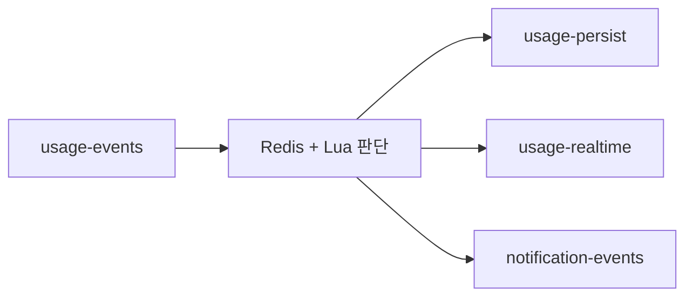
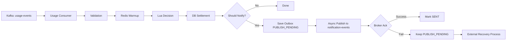

# Service Overview

## 1. Purpose

`dabom-processor-usage`는 `usage-events`를 소비해 사용량 이벤트를 처리하는 서비스다.

현재 이 서비스가 수행하는 일은 아래와 같다.

- payload 기본 검증
- `familyId-customerId` 관계 검증
- Redis warmup
- Redis + Lua 기반 상태 계산
- DB 직접 정산
- notification 대상 판단
- notification 즉시 비동기 발행 시도
- 발행 실패 건에 대한 복구 기준점 저장

즉 이 서비스는 단순 consumer가 아니라, 실시간 판단과 정산, notification 파생을 함께 담당하는 usage processing service다.

## 2. What the Previous Structure Looked Like

초기에는 usage 처리 결과가 여러 Kafka 토픽으로 분산되는 구조였다.

- `usage-events`
- `usage-persist`
- `usage-realtime`
- `notification-events`

당시 흐름은 대략 아래와 같았다.

1. `usage-events` 수신
2. Redis/Lua로 상태 계산
3. `usage-persist`로 DB 정산용 이벤트 발행
4. `usage-realtime`로 실시간 사용량 이벤트 발행
5. `notification-events`로 알림 이벤트 발행

즉 usage 이벤트 1건이 들어오면, 그 결과가 여러 토픽으로 다시 분기되는 구조였다.

## 3. Why the Structure Changed

이전 구조는 기능을 토픽으로 분리했다는 점에서는 단순해 보일 수 있었지만, 실제 usage 처리 관점에서는 아래 문제가 있었다.

### 3.1 DB 정산 책임이 멀리 떨어져 있었다

usage 상태를 계산하는 곳과 DB 정산을 수행하는 곳이 `usage-persist` 경로로 분리돼 있었다.

이 때문에:
- 사용량 판단과 최종 정산을 한 흐름으로 설명하기 어려웠고
- 실패 시 어디부터 다시 봐야 하는지가 분산되었고
- 멱등성 보장을 어느 지점이 책임지는지 바로 읽히지 않았다.

### 3.2 하나의 이벤트가 여러 토픽으로 분기됐다

usage 이벤트 1건이 들어오면 `usage-persist`, `usage-realtime`, `notification-events`로 다시 나갔다.

이 때문에:
- 운영자가 하나의 usage 이벤트를 추적하려면 여러 토픽을 같이 봐야 했고
- 장애 시 “이 이벤트가 어느 단계까지 진행됐는가”를 설명하기 어려웠고
- 실시간 판단과 정산, 알림 사이의 관계가 문서 없이 코드만 봐서는 잘 드러나지 않았다.

### 3.3 notification의 즉시성과 복구 지점이 분리돼 있었다

알림은 발행 자체는 Kafka 경로로 보내지만, 발행 실패 후 어떤 기준으로 다시 복구할 것인지는 명확한 경계가 필요했다.

이 때문에:
- 즉시 발행과 복구 발행의 책임을 나눌 필요가 있었고
- usage 서비스가 어디까지 책임지는지를 분명히 해야 했다.

### 3.4 잘못된 입력을 더 앞에서 끊어야 했다

usage 처리에서 `familyId-customerId` 관계가 틀린 입력은 Redis, Lua, DB, notification까지 내려가지 않는 것이 맞다.

이전보다 더 앞단에서:
- payload 계약 위반
- family-customer 불일치
를 끊는 구조가 필요했다.

## 4. How the Current Structure Solves It

현재 구조는 usage 처리의 핵심 책임을 `usage-events` 처리 서비스 안으로 모으는 방향으로 정리되었다.

### 4.1 DB 정산을 usage 서비스가 직접 수행

이제 `usage-events`를 소비한 직후:
- validation
- Redis/Lua 판단
- DB 정산
이 하나의 서비스 흐름 안에서 이어진다.

효과:
- usage 이벤트 1건이 어떤 순서로 처리되는지 설명이 쉬워짐
- 정산 멱등성과 복구 지점이 이 서비스 기준으로 정리됨

### 4.2 실시간 판단과 영속 정산의 경계 명확화

현재 구조는 역할을 아래처럼 나눈다.

- Redis + Lua: 빠른 판단과 상태 계산
- DB: 최종 정산과 영속 기준점

효과:
- Redis는 실시간성
- DB는 정합성
을 담당한다는 점이 구조적으로 분명해졌다.

### 4.3 notification은 대상 이벤트만 저장하고, 즉시 발행과 복구를 분리

현재 notification 흐름은 아래와 같다.

- notification 대상일 때만 Outbox row 생성
- usage 서비스가 즉시 비동기 발행 시도
- 실패 시 `PUBLISH_PENDING` 유지
- 외부 복구 프로세스가 pending row를 다시 발행

효과:
- 즉시성은 usage 서비스가 담당
- 복구는 Outbox를 기준으로 후속 프로세스가 담당
- notification 관련 상태가 DB row 기준으로 관리된다.

### 4.4 invalid input를 초입에서 차단

`familyId-customerId` 관계를 Redis membership cache와 DB fallback으로 검증한다.

효과:
- 잘못된 입력이 Redis 상태를 오염시키지 않음
- 잘못된 입력이 DB 정산이나 notification으로 이어지지 않음

## 5. Why These Technologies

## 5.1 Why a Messaging Queue Was Needed

usage 도메인은 사용량 이벤트가 한 번에 몰릴 수 있고, 생산 시점과 처리 시점을 느슨하게 분리할 필요가 있다.

메시징 큐를 두면 아래가 가능해진다.

- usage 발생 서비스와 usage 처리 서비스를 분리
- burst traffic를 흡수하면서 순차 처리 기준 유지
- consumer 재처리와 장애 복구 기준 확보
- 후속 파생 처리(notification 등)를 이벤트 중심으로 연결

즉 이 서비스에서 메시징 큐는 단순 전송 채널이 아니라, usage 이벤트를 안정적으로 흘려보내는 비동기 처리 기반이다.

## 5.2 Why Kafka

이 서비스가 Kafka를 쓰는 이유는 아래와 같다.

- usage 이벤트는 실시간으로 많이 들어오는 스트림 성격이 강하다.
- 이벤트를 순서 있게 계속 소비해야 한다.
- 장애 시 같은 레코드를 다시 처리할 수 있는 재처리 모델이 중요하다.
- usage, notification처럼 다른 후속 토픽과도 자연스럽게 연결된다.

Kafka는 이런 usage stream 처리에 잘 맞는다.

- 토픽 기반으로 이벤트 흐름을 분리할 수 있다.
- consumer group으로 수평 확장이 가능하다.
- offset 기반이라 재처리와 운영 추적이 명확하다.
- 고TPS 이벤트 스트림 처리에 적합하다.

또한 이 서비스는 가족 단위 상태를 많이 다룬다.

- `family_quota`
- 가족 잔여량
- 가족 단위 경고/차단 판단

이런 구조에서는 같은 가족의 이벤트를 같은 흐름에서 순서 있게 처리하는 것이 유리하다. Kafka는 key 기반 partitioning을 기본적으로 지원하므로, `familyId`를 기준으로 같은 가족 이벤트를 같은 파티션 흐름에 태우는 모델과 잘 맞는다.

즉 Kafka는 “업무 명령 전달”보다 “지속적으로 쌓이는 이벤트 스트림 처리”와 “가족 기준 순서가 중요한 usage 처리”에 더 잘 맞는 선택이다.

## 5.3 Why Not RabbitMQ

RabbitMQ 같은 메시지 브로커도 충분히 훌륭하지만, 이 서비스가 다루는 문제와는 성격이 조금 다르다.

RabbitMQ가 더 잘 맞는 경우는 보통 아래와 같다.

- 작업 큐 기반의 명령 처리
- 복잡한 라우팅 규칙
- 빠른 단건 전달과 ack 중심의 메시징

반면 `dabom-processor-usage`는 아래 특성이 더 중요하다.

- 사용량 이벤트가 지속적으로 들어오는 stream 처리
- offset 기준 재처리
- consumer group 확장
- 같은 가족 이벤트의 순서 있는 처리

RabbitMQ에서도 유사한 구성을 만들 수는 있지만, 일반 queue 모델에서는 Kafka처럼 key 기반 partitioning이 기본 모델은 아니다. 같은 가족의 이벤트를 같은 흐름에서 안정적으로 처리하려면 추가 라우팅 설계나 stream 계열 구성이 필요하다.

즉 이 서비스는 “하나의 작업을 누가 소비할까”보다 “계속 들어오는 usage 이벤트 흐름을 어떻게 안정적으로 처리할까”가 더 중요한 서비스다. 그 점에서 Kafka가 더 자연스럽다.

## 5.4 Why Redis

usage 처리에는 DB만으로는 부족한 구간이 있다.

이 서비스는 아래를 매우 빠르게 판단해야 한다.

- 가족 잔여량이 얼마나 남았는지
- 개인 월 사용량이 얼마인지
- 현재 차단 시간대인지
- 특정 앱이 차단 상태인지
- 지금 알림을 보내야 하는지

이걸 매 이벤트마다 DB만 보고 처리하면:
- 읽기 비용이 커지고
- 동시에 여러 이벤트가 들어올 때 race condition 관리가 어려워지고
- 실시간 판단 속도가 떨어진다.

Redis를 두면:
- 필요한 상태를 메모리에서 빠르게 읽고
- Lua로 원자적으로 갱신과 판단을 같이 수행할 수 있다.

즉 Redis는 단순 캐시가 아니라, usage 실시간 판단 엔진의 일부 역할을 한다.

## 5.5 Why Lua

Redis만 쓰는 것으로는 충분하지 않다. 사용량 증가, 상태 계산, 알림 dedup 판단이 분리되어 있으면 race condition이 생길 수 있기 때문이다.

Lua를 사용하면:
- duplicate 확인
- remaining / monthly usage 반영
- 차단 판단
- 경고 판단
- alert dedup 기록
을 한 번에 원자적으로 처리할 수 있다.

즉 Lua는 “여러 Redis 명령을 한 트랜잭션처럼 묶어 일관된 판단 결과를 만드는 도구”다.

## 5.6 Why Direct DB Settlement

현재 구조는 usage 서비스가 DB 정산을 직접 수행한다.

이렇게 한 이유는 아래와 같다.

- usage 상태 계산과 정산을 한 흐름으로 설명하기 쉽다.
- `usage_record` 기반 멱등 정산을 바로 수행할 수 있다.
- `usage-persist` 같은 중간 토픽을 줄여 처리 경로를 단순화할 수 있다.

즉 직접 정산 구조는 “어디서 최종 정산이 일어나는가”를 usage 서비스 안으로 명확히 모으는 선택이다.

## 5.7 Why Outbox

notification은 즉시 발행만으로 끝내기 어렵다. Kafka publish는 실패할 수 있고, 실패 후 다시 보낼 기준점이 필요하다.

Outbox를 두면:
- notification 대상 이벤트만 DB row로 남기고
- 즉시 발행 실패 시 `PUBLISH_PENDING`을 기준으로 다시 발행할 수 있다.

즉 Outbox는 notification 실패 후 복구 기준점 역할을 한다.

## 6. Current Architecture

현재 구조의 사실은 아래와 같다.

- Kafka listener는 `usage-events` 하나를 처리한다.
- Redis/Lua로 `duplicate`, `status`, `shouldNotify`를 계산한다.
- DB 정산은 이 서비스가 직접 수행한다.
- notification 대상일 때만 Outbox row를 만든다.
- usage 서비스가 notification을 즉시 비동기로 먼저 발행한다.
- 발행 성공 시 `SENT`, 실패 시 `PUBLISH_PENDING`을 유지한다.

## 7. Core Design Points

### 7.1 Redis와 DB의 역할 분리

- Redis: 빠른 판단과 실시간 상태 계산
- DB: 최종 정산과 영속 기준점

### 7.2 DB 정산은 재진입 가능

- `usage_record`가 선행 멱등 가드 역할을 한다.
- allowed 이벤트는 새 `usage_record` insert 성공 시에만 quota를 반영한다.
- blocked 이벤트는 `usage_record` 없이 차단 상태만 반영한다.

### 7.3 잘못된 입력은 초입에서 차단

- `familyId-customerId` 관계를 Redis membership cache와 DB fallback으로 검증한다.
- 실제로 잘못된 조합이면 `IllegalArgumentException`으로 중단한다.
- Redis/DB 조회 자체가 실패하면 retryable 예외로 전파한다.

### 7.4 Notification은 publish-candidate outbox를 사용

- 모든 usage 이벤트를 저장하지 않는다.
- notification 대상 이벤트만 `PUBLISH_PENDING` row를 만든다.
- 즉시 발행 실패 시 row를 남겨 후속 복구가 가능하도록 한다.

## 8. Kafka Topics

| Type | Topic |
|---|---|
| Consumed | `usage-events` |
| Produced | `notification-events` |
| Historical | `usage-persist`, `usage-realtime` |

## 9. Service Boundary

### This Repository Handles
- `usage-events` 소비
- 실시간 사용량 판단
- DB 직접 정산
- notification 대상 판단
- notification 즉시 발행 시도
- notification 복구 기준점 저장

### External Recovery Process Handles
- `PUBLISH_PENDING` 조회
- 재발행 시도
- `SENT` 또는 `FAILED` 반영
