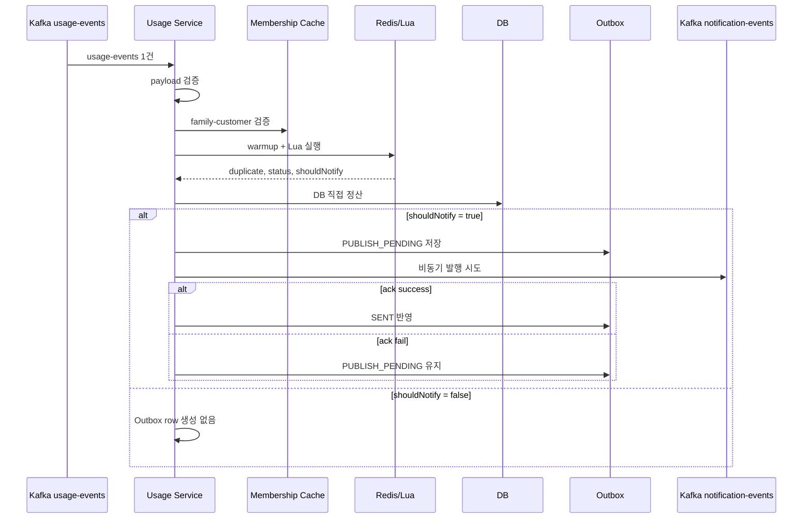

# Processing Flow

## 1. End-to-End Flow

현재 `dabom-processor-usage`의 usage 이벤트 처리 흐름은 아래와 같다.

1. Kafka에서 `usage-events`를 수신한다.
2. payload를 검증한다.
3. `familyId-customerId` 관계를 검증한다.
4. Redis warmup을 수행한다.
5. Lua가 `duplicate`, `status`, `shouldNotify`를 계산한다.
6. Java가 Lua 결과를 해석한다.
7. DB 정산을 직접 수행한다.
8. notification 대상이면 Outbox에 `PUBLISH_PENDING`을 저장한다.
9. notification을 즉시 비동기 발행한다.
10. 성공하면 `SENT`, 실패하면 `PUBLISH_PENDING`을 유지한다.
11. notification 비대상이더라도, 같은 `eventId`에 pending row가 남아 있으면 즉시 발행을 다시 시도한다.

## 2. Validation

### 2.1 Payload Validation

초입에서 아래를 검증한다.

- payload null 여부
- `familyId > 0`
- `customerId > 0`
- `bytesUsed > 0`

이 검증은 가장 앞에서 잘못된 메시지를 차단하기 위한 단계다.

효과:
- Redis 상태 오염 방지
- DB 정산 오염 방지
- 불필요한 후속 처리 방지

### 2.2 Family-Customer Validation

`familyId-customerId` 관계를 Redis membership cache와 DB fallback으로 검증한다.

순서:
1. Redis `family:{familyId}:members` 확인
2. cache hit면 통과
3. miss 또는 불일치면 DB fallback
4. DB에도 없으면 invalid input
5. Redis와 DB 조회가 실패하면 retryable 예외로 전파

이 단계는 usage 이벤트가 실제 가족 구성원 관계를 만족하는지 확인하는 단계다.

효과:
- 잘못된 family-customer 조합 차단
- Redis, Lua, DB, notification까지 잘못된 입력이 내려가지 않음

## 3. Redis + Lua

### 3.1 Redis Warmup

Lua 실행 전에 필요한 Redis 상태를 채운다.

대상:
- 가족 info
- 가족 remaining
- 개인 월 사용량
- policy constraints

warmup은 Redis에 값이 없을 때 DB를 읽어 필요한 키를 채우는 역할을 한다.

효과:
- Lua가 필요한 기준값을 항상 Redis에서 읽을 수 있음
- 월초 첫 이벤트나 캐시 miss 상황에서도 동일한 처리 경로 유지

### 3.2 Lua Decision

Lua는 아래를 원자적으로 수행한다.

- duplicate 여부 확인
- 사용량 반영
- 차단 여부 판단
- 경고 상태 판단
- 알림 dedup 판단
- 결과 캐시 저장

대표 결과:
- `duplicate`
- `status`
- `shouldNotify`
- `totalUsed`
- `remaining`
- `monthlyUsed`
- `userRatio`
- `monthlyLimit`

왜 Lua를 쓰는가:
- Redis read/write와 상태 계산을 한 번에 수행할 수 있기 때문이다.
- 사용량 증가와 상태 판단을 분리하면 race condition이 생길 수 있다.
- Lua는 Redis 내부에서 원자적으로 실행되므로 같은 이벤트가 몰려도 일관된 결과를 만든다.

## 4. Java Decision

Java는 Lua status를 중앙 매퍼에서 해석한다.

지원하는 status:
- `NORMAL`
- `WARNING_50`
- `WARNING_30`
- `WARNING_10`
- `MANUAL`
- `APP_BLOCK`
- `TIME_BLOCK`
- `MONTHLY_LIMIT_EXCEEDED`
- `FAMILY_QUOTA_EXCEEDED`

이 단계에서 아래가 정해진다.

- DB persist result
- notification 대상 여부
- notification payload 의미

즉 Lua는 상태 문자열을 반환하고, Java는 그 문자열을 후속 처리 규칙으로 바꾸는 역할을 맡는다.

## 5. Direct DB Settlement

DB 정산은 usage 서비스가 직접 수행한다.

### 5.1 allowed 이벤트
1. `usage_record` insert 시도
2. 새 insert 성공 시에만
   - `customer_quota`
   - `family_quota`
   반영

### 5.2 blocked 이벤트
- `usage_record`는 만들지 않음
- `customer_quota` 차단 상태 반영

allowed와 blocked를 나누는 이유는 아래와 같다.

- allowed 이벤트는 실제 사용량 증가를 영속화해야 한다.
- blocked 이벤트는 사용이 허용되지 않았으므로 사용량 row를 만들지 않고 차단 상태만 반영한다.

같은 이벤트가 다시 들어와도 `usage_record`가 멱등 가드 역할을 한다.

## 6. Notification Flow

notification은 아래 조건을 모두 만족할 때만 대상이다.

- status 기준으로 알림 대상
- Lua 결과 기준 `shouldNotify = true`

notification 대상이면:
1. Outbox에 `PUBLISH_PENDING` 저장
2. `NotificationPayload`를 직렬화해 `payload_json`에 저장
3. usage 서비스가 즉시 비동기로 발행 시도
4. 성공하면 `SENT`
5. 실패하면 `PUBLISH_PENDING` 유지

notification 비대상이면 새 Outbox row는 만들지 않는다.

이 구조의 의미는 아래와 같다.

- 즉시성은 usage 서비스가 담당한다.
- 발행 실패 후 복구 기준점은 Outbox가 담당한다.
- notification 대상이 아닌 이벤트는 불필요한 DB row를 남기지 않는다.

## 7. Processing Sequence

## 8. Why This Flow Matters

이 흐름에서 중요한 점은 아래 세 가지다.

1. 실시간 판단과 영속 정산이 분리되어 있다.
- Redis/Lua는 빠른 판단
- DB는 최종 정산

2. 멱등성이 구조 안에 들어가 있다.
- Redis dedup
- `usage_record` 기반 DB 멱등 정산

3. notification은 즉시성과 복구성을 동시에 가진다.
- 즉시 비동기 발행
- Outbox 기반 후속 복구
