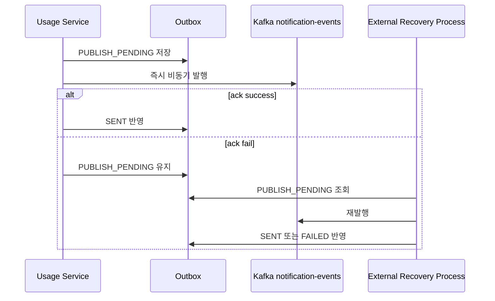

# Outbox and Retry

## 1. Outbox Role

`usage_event_outbox`는 notification 발행 상태를 남기기 위한 테이블이다.

현재 구조의 핵심은 아래와 같다.

- 모든 usage 이벤트를 저장하지 않는다.
- notification 대상 이벤트만 저장한다.
- 저장되는 payload는 `EventEnvelope`가 아니라 `NotificationPayload` JSON이다.
- 즉시 발행 실패 시 `PUBLISH_PENDING`이 남는다.

즉 이 테이블은 usage 이벤트 전체 로그가 아니라, notification 발행과 복구를 위한 상태 저장소다.

## 2. Why the Outbox Shape Changed

초기에는 usage 처리 전체를 더 넓게 추적하는 방향도 고려할 수 있었지만, 현재 구조는 notification 대상 이벤트만 저장하는 방향으로 정리되었다.

이렇게 정리한 이유는 아래와 같다.

- usage 도메인에서는 notification 비대상 이벤트 비율이 높을 수 있다.
- 고TPS 환경에서는 모든 이벤트를 DB row로 남기는 방식이 부담이 커진다.
- 실제로 복구가 필요한 지점은 notification 발행 실패 구간이다.

그래서 현재 Outbox는 아래 역할에 집중한다.

- notification 대상 확정
- 즉시 발행 후 상태 추적
- 후속 복구 프로세스 인계

## 3. Stored Data

주요 컬럼 의미:
- `event_id`: 원본 usage 이벤트 식별자
- `family_id`: 가족 ID
- `customer_id`: trigger 사용자 ID
- `status`: `PUBLISH_PENDING`, `SENT`, `FAILED`
- `payload_json`: 최종 `NotificationPayload` JSON
- `retry_count`, `next_retry_at`, `last_error`: 복구 프로세스 상태 관리용

여기서 `event_id`는 notification 이벤트 id가 아니라, 원본 usage 이벤트 id다.
즉 이 row가 어떤 usage 이벤트에서 파생됐는지를 추적하는 키다.

## 4. Payload Shape

Outbox에는 `EventEnvelope`가 아니라 최종 `NotificationPayload` JSON을 저장한다.

이렇게 한 이유는 아래와 같다.

- 즉시 발행과 복구 발행이 같은 payload를 사용하게 하기 위해서
- 복구 프로세스가 payload를 다시 조립하지 않고 바로 재발행할 수 있게 하기 위해서
- notification의 business payload와 Kafka envelope 생성을 분리하기 위해서

즉 Outbox는 “무엇을 보낼 것인가”를 저장하고, 실제 envelope 생성은 발행 시점에 수행한다.

## 5. Outbox Status

### 5.1 PUBLISH_PENDING
- notification 발행 대상 확정 완료
- 아직 성공적으로 마감되지 않은 상태

이 상태는 아래 상황을 포함한다.
- 즉시 발행 전
- 즉시 발행 실패 후
- 후속 복구 프로세스 대기 중

### 5.2 SENT
- notification Kafka publish 성공이 반영된 상태

### 5.3 FAILED
- 복구 프로세스가 최종 실패로 마감한 상태

## 6. Immediate Publish Policy

usage 서비스는 notification을 즉시 비동기로 먼저 발행한다.

- 성공 callback이면 `SENT`
- 실패 callback이면 `PUBLISH_PENDING` 유지

즉 usage 서비스는 즉시성을 담당하고, 복구 프로세스는 pending row를 기준으로 후속 발행을 수행한다.

이 구조를 사용하면:
- 정상 케이스에서는 즉시 알림 전파
- 실패 케이스에서는 row 기준 복구
가 가능해진다.

## 7. Retry Layers

### 7.1 Consumer Retry

lib-kafka 분류 기준:
- `IllegalArgumentException` -> `IGNORE`
- `KafkaMessageProcessingException` -> `RETRY`
- `NonRetryableKafkaMessageProcessingException` -> `DLQ`

현재 이 레포는 consumer retry 설정을 별도로 override하지 않는다.

즉 usage 이벤트 처리 도중 발생한 retryable 예외는 consumer 레벨에서 다시 처리된다.

### 7.2 Service Re-entry

같은 `eventId`가 다시 들어오면 아래가 다시 수행될 수 있다.

- Redis warmup
- Lua 실행
- DB 정산
- pending notification 재발행 시도

이 레이어는 duplicate와 retry를 엄격히 구분하기보다, 같은 이벤트 재진입을 안전하게 흡수하는 역할을 한다.

### 7.3 External Recovery Process

복구 프로세스는 `PUBLISH_PENDING`을 대상으로 아래 순서로 동작한다.

1. `PUBLISH_PENDING` 조회
2. `payload_json` 역직렬화
3. `notification-events` 재발행
4. 성공 시 `SENT` 반영
5. 필요 시 `retry_count`, `next_retry_at`, `last_error` 갱신
6. 최종 실패 시 `FAILED` 반영

즉 usage 서비스는 즉시 발행까지, 복구 프로세스는 pending row 후속 발행까지 담당한다.

## 8. Failure Handling Summary

| 유형 | 처리 방식 |
|---|---|
| invalid payload / 잘못된 family-customer | `IGNORE` |
| membership lookup, Redis warmup, Lua, DB 정산, Outbox 저장 실패 | `RETRY` |
| 상태 계약 불일치 / 복구 불가 직렬화 오류 | `DLQ` |
| 즉시 notification 발행 실패 | `PUBLISH_PENDING` 유지 |

## 9. Outbox Sequence

## 10. Why This Design Matters

현재 Outbox 설계의 핵심은 아래 세 가지다.

1. notification 대상 이벤트만 저장한다.
- 불필요한 row를 줄인다.
- 고TPS 환경에서 DB hot path 비용을 줄인다.

2. payload를 최종 notification 형태로 저장한다.
- 즉시 발행과 복구 발행이 같은 데이터를 사용한다.
- 복구 프로세스가 단순해진다.

3. 즉시성과 복구성을 분리한다.
- usage 서비스는 즉시 발행을 담당
- Outbox와 복구 프로세스는 실패 후 후속 발행을 담당
