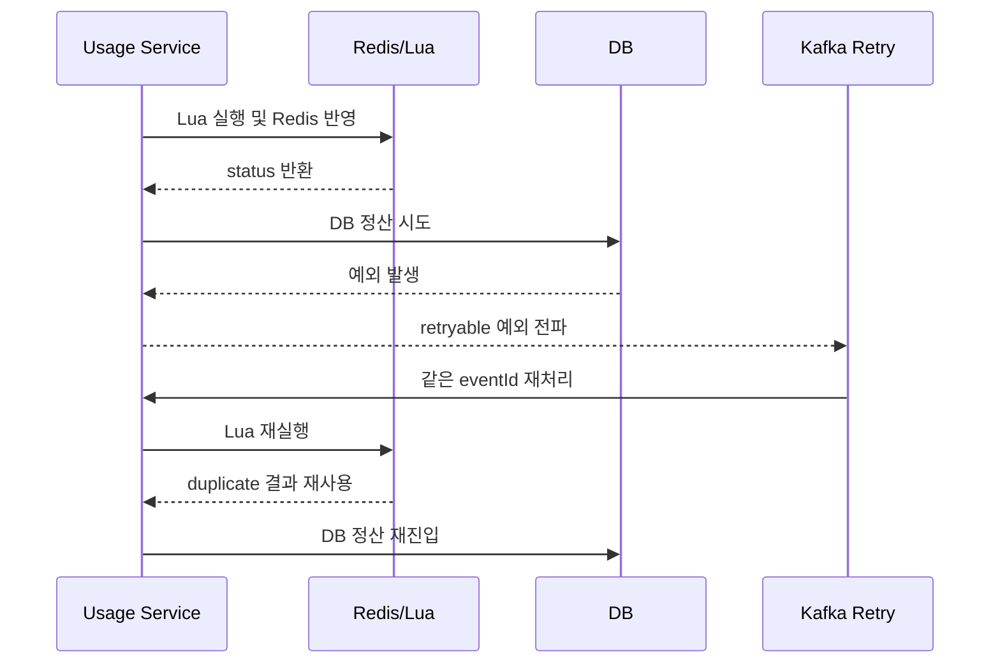
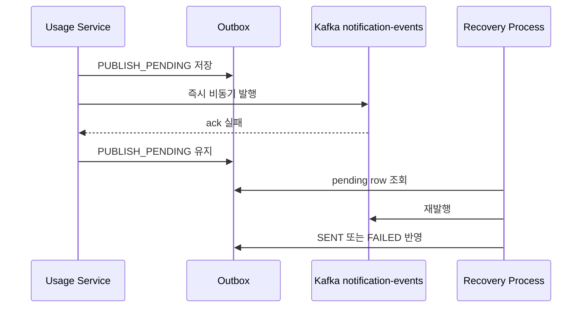

# Exception and Recovery Guide

## 1. Purpose

이 문서는 `usage-events` 처리 각 단계에서 예외가 발생했을 때 현재 구조가 어떤 방식으로 복구와 정합성을 유지하는지 정리한다.

핵심은 아래 세 가지다.

- 잘못된 입력은 초입에서 차단한다.
- retryable 예외는 같은 Kafka 레코드를 다시 처리한다.
- duplicate와 재처리를 구조적으로 흡수한다.

## 2. Step-by-Step Recovery

| 단계 | 실패 유형 | 처리 방식 | 복구 전략 |
|---|---|---|---|
| Payload Validation | payload null, 음수/0 값 | `IllegalArgumentException` | 잘못된 입력으로 종료 |
| Family-Customer Validation | 실제 소속 불일치 | `IllegalArgumentException` | 잘못된 입력으로 종료 |
| Family-Customer Validation | Redis/DB 조회 실패 | `KafkaMessageProcessingException` | consumer 재처리 |
| Redis Warmup | info/remaining/monthly usage warmup 실패 | `KafkaMessageProcessingException` | consumer 재처리 |
| Lua Execution | null 결과, invalid 배열 | `KafkaMessageProcessingException` | consumer 재처리 |
| Lua Status Mapping | 지원하지 않는 status | `NonRetryableKafkaMessageProcessingException` | DLQ |
| DB Settlement | `usage_record`, quota 반영 실패 | 예외 전파 | 트랜잭션 롤백 + consumer 재처리 |
| Outbox Serialization | payload JSON 직렬화/역직렬화 실패 | `NonRetryableKafkaMessageProcessingException` | DLQ |
| Outbox Save | `PUBLISH_PENDING` 저장 실패 | 예외 전파 | consumer 재처리 |
| Immediate Publish | Kafka publish ack 실패 | 예외 콜백 처리 | `PUBLISH_PENDING` 유지 + 복구 프로세스 재발행 |

## 3. Why Each Recovery Strategy Exists

### 3.1 Validation 단계는 재시도보다 격리가 중요하다

payload 계약 위반이나 family-customer 불일치는 다시 처리해도 바뀌지 않는다.

그래서 이 단계의 목표는:
- 빨리 실패시키고
- 뒤 단계를 오염시키지 않고
- 불필요한 재시도를 만들지 않는 것
이다.

### 3.2 Redis/Lua/DB 단계는 다시 처리할 수 있어야 한다

이 단계들은 일시적인 인프라 문제나 타이밍 이슈가 발생할 수 있다.

그래서 이 단계의 목표는:
- retryable 예외로 분류하고
- 같은 usage 이벤트를 다시 처리하게 하고
- 같은 이벤트 재진입 시에도 결과가 깨지지 않게 하는 것
이다.

### 3.3 notification 단계는 복구 기준점이 필요하다

즉시 발행은 실패할 수 있다. 그래서 usage 서비스는 발행 대상일 때 Outbox에 `PUBLISH_PENDING`을 남긴다.

이 단계의 목표는:
- 정상 케이스에서는 바로 보내고
- 실패 케이스에서는 pending row를 기준으로 다시 보낼 수 있게 하는 것
이다.

## 4. Loss Prevention Strategy

### 4.1 Invalid Input Isolation

잘못된 payload와 잘못된 family-customer 조합은 초입에서 차단한다.

효과:
- Redis 오염 방지
- DB 오염 방지
- 불필요한 notification 방지

### 4.2 Redis Re-apply Prevention

Lua는 `event:dedup:usage:{eventId}` 키를 사용해 같은 이벤트가 다시 들어와도 Redis 증감을 다시 수행하지 않는다.

효과:
- consumer 재처리 시 Redis 중복 반영 방지
- duplicate와 retry가 같은 경로로 들어와도 Redis 상태 안정화

### 4.3 DB Idempotent Settlement

allowed 이벤트는 `usage_record` insert가 먼저 수행되고, 새 insert 성공 시에만 quota를 반영한다.

효과:
- 같은 `eventId` 재처리 시 `usage_record`가 멱등 가드 역할
- `customer_quota`, `family_quota` 중복 반영 방지

### 4.4 Notification Recovery Point

notification 대상 이벤트는 Outbox에 `PUBLISH_PENDING`을 저장한 뒤 즉시 비동기 발행을 시도한다.

효과:
- 즉시 발행 성공 시 `SENT` 반영
- 즉시 발행 실패 시 `PUBLISH_PENDING`을 기준으로 후속 복구 가능

## 5. Recovery Sequence Examples

### 5.1 Redis 반영 후 DB 정산 실패

이 시나리오의 핵심은 아래와 같다.

- Redis는 이미 반영되었지만
- 같은 이벤트 재처리 시 Lua dedup cache가 Redis 재반영을 막는다.
- DB 정산은 다시 진입하고, 최종적으로 영속 상태가 Redis 판단 결과를 따라간다.

### 5.2 Outbox 저장 후 즉시 발행 실패

이 시나리오의 핵심은 아래와 같다.

- 즉시 발행은 실패할 수 있다.
- 하지만 pending row가 이미 남아 있으므로 복구 기준점은 유지된다.
- 후속 복구 프로세스는 payload를 다시 만들지 않고 row 기준으로 재발행할 수 있다.

## 6. Stage-by-Stage Guarantees

| 구간 | 정합성 포인트 |
|---|---|
| Validation | 잘못된 입력은 뒤 단계로 내려가지 않음 |
| Redis + Lua | duplicate 결과와 상태 계산을 원자적으로 처리 |
| DB Settlement | `usage_record` 기반 멱등 정산 |
| Notification | 대상 이벤트만 Outbox 저장 + 발행 상태 관리 |

## 7. Reading Guide

이 문서를 볼 때는 아래 순서로 읽으면 된다.

1. 어떤 실패가 retryable인지 확인한다.
2. 그 실패가 Redis, DB, notification 중 어느 계층에서 일어나는지 본다.
3. 이후 재처리 기준점이 Redis dedup인지, DB 멱등성인지, Outbox인지 확인한다.

즉 현재 구조는 실패 유형마다 복구 기준점을 다르게 두는 방식으로 정리되어 있다.
