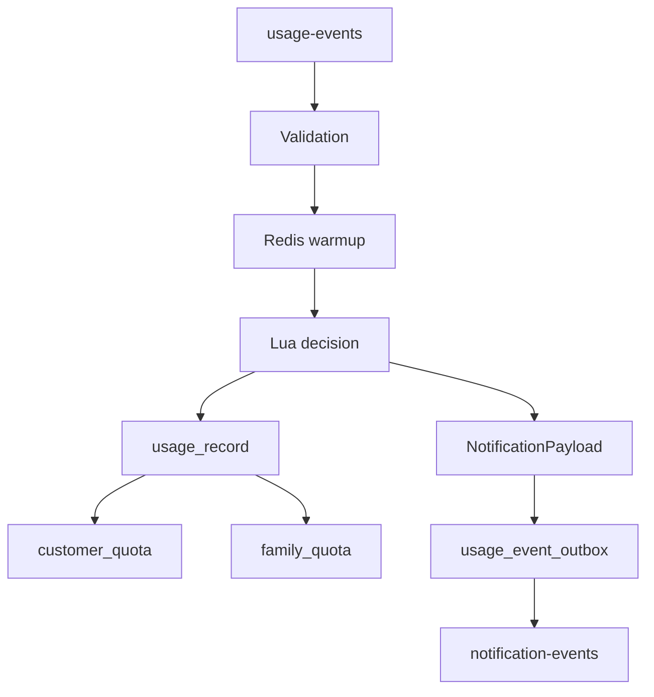

# Data Model and Redis Keys

## 1. Purpose

이 문서는 `dabom-processor-usage`가 사용하는 핵심 저장 구조를 정리한다.

- MySQL 영속 데이터
- notification outbox payload
- Redis key 구조
- Lua dedup/cache 구조

핵심은 usage 이벤트 1건이 어떤 저장 구조를 통과하고, 그 구조가 각각 어떤 역할을 맡는지 이해하는 것이다.

## 2. MySQL Settlement Model

### 2.1 usage_record

allowed 이벤트의 멱등 가드 역할을 한다.

- 같은 `eventId`가 다시 들어오면 중복 insert를 막는다.
- 새 row가 들어간 경우에만 quota 반영이 이어진다.

즉 `usage_record`는 “이 usage 이벤트가 실제 사용량 증가로 정산되었는가”를 고정하는 기준점이다.

### 2.2 customer_quota

고객 기준 월 사용량과 차단 상태를 반영한다.

- allowed 이벤트: 월 사용량 증가
- blocked 이벤트: 차단 상태 반영

즉 customer 단위 정책과 월 사용량을 영속 기준으로 관리하는 구조다.

### 2.3 family_quota

가족 기준 월 사용량을 반영한다.

- allowed 이벤트에서만 증가
- 가족 잔여량과 경고/차단 판단의 기준이 된다.

즉 Redis에서 빠르게 판단하는 기준값도 결국 DB의 `family_quota` 영속 상태를 바탕으로 warmup 된다.

## 3. Why This Model Matters

현재 정산 구조가 이렇게 나뉜 이유는 아래와 같다.

- `usage_record`: 이벤트 멱등성 기준점
- `customer_quota`: 고객 단위 월 사용량과 차단 상태 기준점
- `family_quota`: 가족 단위 총 사용량과 잔여량 기준점

즉 하나의 테이블에 모든 의미를 몰아넣지 않고, usage 이벤트의 역할을 나누어 영속화한다.

## 4. Outbox Payload Model

Outbox에는 `EventEnvelope`가 아니라 최종 `NotificationPayload` JSON이 저장된다.

주요 필드:
- `familyId`
- `customerId`
- `type`
- `title`
- `message`
- `data`

`data`에는 아래 추적 정보가 들어간다.
- `originEventId`
- `eventTime`
- `status`
- `familyId`
- `customerId`
- `appId`
- `bytesUsed`

이렇게 저장하는 이유는 아래와 같다.

- 즉시 발행과 복구 발행이 같은 payload를 사용하게 하기 위해서
- 복구 프로세스가 notification 내용을 다시 계산하지 않게 하기 위해서
- usage 이벤트와 notification payload의 연결 관계를 row 안에 보존하기 위해서

## 5. Redis Key Structure

### 5.1 Family State

- `family:{familyId}:info:{yyyyMM}`
- `family:{familyId}:remaining:{yyyyMM}`
- `family:{familyId}:members`

각 키의 의미:
- `info`: 가족 총 quota와 메타 정보
- `remaining`: 현재 가족 잔여량
- `members`: family-customer 검증용 membership set

### 5.2 Customer State

- `family:{familyId}:customer:{customerId}:usage:monthly:{yyyyMM}`
- `family:{familyId}:customer:{customerId}:constraints`

각 키의 의미:
- `usage:monthly`: 개인 월 사용량 캐시
- `constraints`: 차단 시간, 앱 차단, 월 한도 같은 정책 제약

### 5.3 Alert Dedup Keys

경고 알림:
- `family:{familyId}:customer:{customerId}:alert:THRESHOLD:50:{yyyyMM}`
- `family:{familyId}:customer:{customerId}:alert:THRESHOLD:30:{yyyyMM}`
- `family:{familyId}:customer:{customerId}:alert:THRESHOLD:10:{yyyyMM}`

차단 알림:
- `family:{familyId}:customer:{customerId}:alert:MANUAL:{yyyyMM}`
- `family:{familyId}:customer:{customerId}:alert:APP_BLOCK:{appId}:{yyyyMM}`
- `family:{familyId}:customer:{customerId}:alert:TIME_BLOCK:{yyyyMM}`
- `family:{familyId}:customer:{customerId}:alert:MONTHLY_LIMIT_EXCEEDED:{yyyyMM}`
- `family:{familyId}:customer:{customerId}:alert:FAMILY_QUOTA_EXCEEDED:{yyyyMM}`

이 키들은 이번 달 같은 유형 알림을 다시 발행하지 않도록 제어하는 역할을 한다.

### 5.4 Event Dedup Key

- `event:dedup:usage:{eventId}`

이 키에는 Lua 결과 캐시가 저장된다.

즉 이 키는 같은 usage 이벤트가 다시 들어왔을 때 Redis 증감을 다시 하지 않게 하는 기준점이다.

## 6. Lua Result Cache

dedup cache에는 아래 정보가 함께 저장된다.

- `totalUsed`
- `remaining`
- `status`
- `monthlyUsed`
- `userRatio`
- `monthlyLimit`
- `shouldNotify`
- `duplicate`

이 정보가 같이 저장되는 이유는 아래와 같다.

- 같은 이벤트 재처리 시 Redis 재반영 방지
- 이전 계산 결과 재사용
- Java가 동일한 상태 해석을 다시 수행할 수 있음
- duplicate와 retry가 같은 경로로 들어와도 일관된 결과 유지

## 7. Data Flow View

## 8. Reading the Model as a Whole

이 모델을 전체로 보면 역할이 다음처럼 나뉜다.

- Redis: 빠른 상태 계산
- `usage_record`: 이벤트 멱등성 기준점
- `customer_quota`, `family_quota`: 최종 정산 기준점
- Outbox: notification 발행 상태 기준점

즉 `dabom-processor-usage`는 하나의 usage 이벤트를 처리하면서도, 각 저장 구조를 서로 다른 책임에 맞게 사용하도록 설계된 서비스다.
